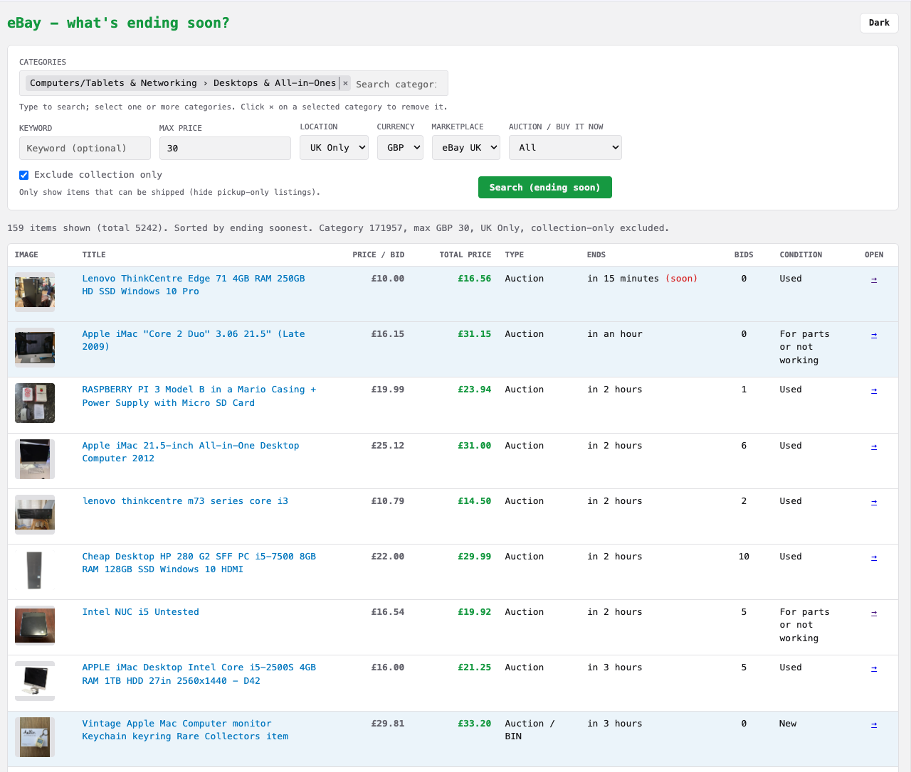

# eBay Fiddle – Bargains Ending Soon

A simple PHP web app that uses the **eBay Browse API** to hunt for potential bargains: browse any category by **keyword** and **category ID**, sorted by **ending soonest**. Great for spotting last-minute auction deals and short-dated listings. No login required; uses app-only OAuth.



## Features

- **Keyword** and **category ID** search (e.g. “laptop”, category 177, or any category you choose)
- **Max price** filter to focus on your budget
- **Sort: ending soonest** so auctions and short-dated listings appear first
- Dense table: image, title, price/bid, end date/time, bid count, condition, link to eBay
- **Reserve not met**: for the top 10 results, auction items with 0 bids get a single bulk `getItems` call; rows where the reserve isn’t met are highlighted in red (requires `buy.item.bulk` scope if your keyset uses separate scopes).

## Requirements

- PHP 8.0+ with `curl` and `json` extensions
- eBay developer app (Production) with **Browse API** access

## Front-end assets (optional build step)

JS/CSS (moment.js, Tom Select) are served from `public/vendor/`. To refresh them from npm:

```bash
npm install
npm run build
```

This copies `moment.min.js`, `tom-select.css`, and `tom-select.complete.min.js` from `node_modules` into `public/vendor/`. If `public/vendor/` is already populated (e.g. committed), you can run the app without Node/npm.

## Setup

1. **eBay Developer Account**
   - Go to [eBay Developers Program](https://developer.ebay.com/).
   - Create an application and get **Production** credentials (Client ID and Client Secret).
   - Ensure your app has **OAuth scope** `https://api.ebay.com/oauth/api_scope` (default for Browse API). Reserve-price highlighting also uses the Browse API `getItems` method, which may require scope `https://api.ebay.com/oauth/api_scope/buy.item.bulk` depending on your keyset.
   - **You cannot add scopes in the developer portal.** Scopes are assigned to your application keyset when the keys are created. To see which scopes your app has: go to **Application Keys**, then use the **OAuth Scopes** link (lower-right of the keys section). If `getItems` returns 403 or you don’t see reserve highlighting, your keyset may not include `buy.item.bulk`; contact [eBay Developer Support](https://developer.ebay.com/support) to request it.

2. **Configure credentials**
   - Copy `.env.example` to `.env`.
   - On the [Application Keys](https://developer.ebay.com/my/keys) page, in the **keys table** (not the token popup), copy:
     - **App ID (Client ID)** → put it in `.env` as `EBAY_CLIENT_ID`
     - **Secret** (OAuth Client Secret) → put it in `.env` as `EBAY_CLIENT_SECRET`
   - **Do not** use the value from “Get OAuth Application Token” — that’s a short‑lived token; this app needs the static App ID and Secret so it can request tokens itself.

   Alternatively set the same variables in your environment (e.g. `export EBAY_CLIENT_ID=...`).

3. **Run the app**
   - From the project root:
     ```bash
     php -S localhost:8080 -t public
     ```
   - Open [http://localhost:8080](http://localhost:8080).

## Usage

- On load, the app runs a search with example defaults (e.g. keyword “laptop”, category **177**, max price **$300**), sorted by **ending soonest**.
- Change keyword, category ID, or max price and click **Search** to refresh. Use any category to find bargains ending soon—auctions, Buy It Now with short end dates, etc.
- Example category IDs (eBay US): **177** = PC Laptops & Netbooks, **175672** = Laptops & Netbooks. Search [eBay's category tree](https://www.ebay.com/b/Electronics/bn_7000259124) or the API to find IDs for other categories.

## Project layout

- `public/index.php` – Single page: form + results table.
- `src/EbayApi.php` – eBay OAuth (client credentials) + Browse API `item_summary/search`.
- `config.php` – Loads `.env` and exposes `$clientId` / `$clientSecret`.

No Composer or external SDK; only PHP and curl.
